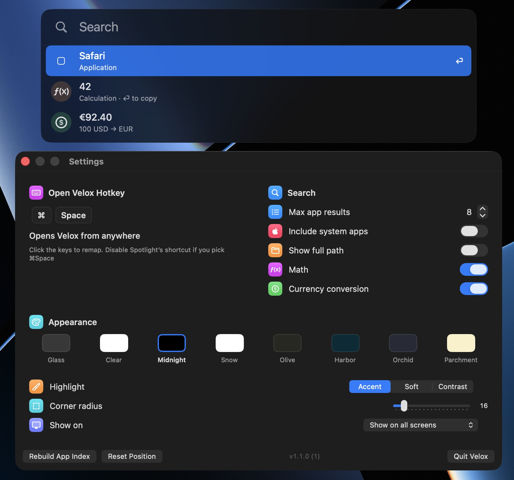

# Velox

Ultra-fast native macOS Spotlight-style launcher



Raycast is bloated and slow. Apple's Spotlight is buggy, opinionated, and not customizable. Velox keeps Spotlight's feel: a floating panel, collapsed until you type, keyboard-first. It only borrows from Raycast when that makes app search, math, or currency faster

## Install

```bash
brew tap rursache/tap && brew trust rursache/tap && brew install --cask velox
```

## Features

- Instant fuzzy app search (`gc` → Google Chrome) across `/Applications`, `~/Applications`, system apps, and `/Applications` on attached external disks
- Calculator and currency conversion (`12*8+4`, `40 is 45% of`, `$21k to EUR`), both **on** by default. Rates refresh on launch and every hour
- Remappable hotkey (default **⌥Space**)
- Bar themes: Glass, Clear, Midnight, Snow, Olive, Harbor, Orchid, Parchment, plus a separate result highlight and live corner radius
- Show on the screen with the mouse, the active window, or all screens
- Menu bar left-click opens Settings. A second launch shows the already-running instance

Requires macOS 15. Extra Apple system apps stay **off** by default. Everyday apps like Safari stay visible

## License

[MIT](LICENSE)
